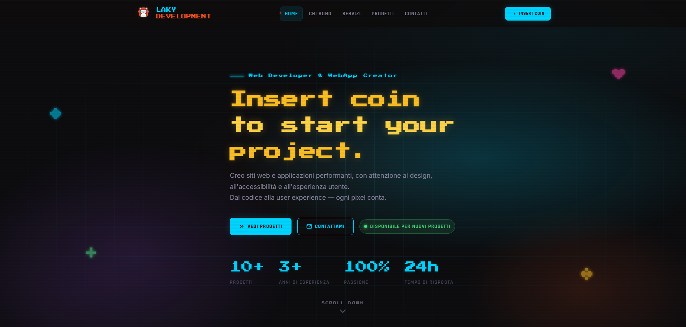

# 🎮 Laky Development — Portfolio personale

**Web Developer & WebApp Creator**  
*Insert coin to start your project.*

📍 Italia  
🌐 Demo: [lakydevelopment.com](https://lakydevelopment.com)
## 📸 Preview
[](https://lakydevelopment.com)
---

## 👋 Chi sono

Portfolio personale e vetrina dei servizi di **Laky Development**: sviluppo di siti web, web app leggere, landing page e soluzioni digitali su misura per progetti professionali.

Mi occupo di:
- sviluppo web front-end;
- siti statici e single page application;
- automazioni con JavaScript e Google Sheets;
- integrazione form e sistemi di raccolta dati;
- gestione di progetti digitali e contenuti online.

---

## 🛠️ Stack tecnologico

- **HTML5** — struttura semantica e accessibile
- **CSS3** — design system con custom properties, Grid e Flexbox
- **JavaScript (vanilla)** — SPA router, animazioni, logica interattiva
- **GSAP 3** — animazioni fluide
- **Three.js** — canvas hero in background
- **Google Fonts** — Press Start 2P, Rajdhani, Inter, VT323

🚫 Nessun framework  
🚫 Nessun bundler  
🚫 Zero dipendenze npm

---

## ✨ Funzionalità

- Boot screen con barra di caricamento pixel-style
- SPA con navigazione client-side senza reload
- Pixel decorations con animazioni organiche
- CRT scanlines in stile retro
- Scroll HUD con barra di progresso lettura
- Achievement toast stile arcade
- Easter egg Konami Code: `↑ ↑ ↓ ↓ ← → ← → B A`
- Typewriter effect sul titolo hero
- Counter animation per statistiche
- Form contatto integrato con Web3Forms
- Dark theme con palette neon
- Design responsive mobile-first
- Accessibilità con supporto a `prefers-reduced-motion` e landmark ARIA

---

## 📁 Struttura del progetto

```txt
lakyDevelopment/
├── index.html          # Tutta l'app in un unico file
├── assets/
│   ├── logo.png
│   ├── og-image.png
│   ├── preview.png
│   └── projects/       # Screenshot progetti
├── CNAME
└── README.md
```

---

## 📄 Pagine

| Pagina | Contenuto |
|---|---|
| **Home** | Hero, stack tecnologico, workflow, testimonianze |
| **About** | Bio, esperienza, tech stack, approccio |
| **Services** | Pacchetti, prezzi, FAQ |
| **Projects** | Portfolio con filtri per categoria |
| **Contact** | Form contatto, info utili |

---

## 💼 Servizi

### Sito vetrina
Ideale per professionisti, associazioni e piccoli progetti che vogliono una presenza online pulita, veloce e credibile.

### Landing page
Perfetta per campagne, raccolta contatti e presentazioni di servizi o eventi.

### Web app leggera
Soluzioni dinamiche senza framework pesanti, pensate per semplicità, velocità e manutenzione.

### Automazioni e integrazioni
Form, Google Sheets, Web3Forms, gestione dati e piccoli flussi automatici.

---

## 🚀 Avvio locale

Non richiede installazione. Puoi aprire `index.html` direttamente nel browser oppure usare un server locale.

### Con VS Code
Installa l’estensione **Live Server** e clicca su **Go Live**.

### Con Python
```bash
python -m http.server 8080
```

### Con Node.js
```bash
npx serve .
```

---

## 📬 Contatti

- 🌐 Sito: [lakydevelopment.com](https://lakydevelopment.com)
- 📧 Email: info@lakydevelopment.com
- 💼 LinkedIn: aggiungi qui il tuo profilo
- 🐙 GitHub: aggiungi qui il tuo profilo

---

## 📜 Licenza

Questo progetto **non è distribuito con una licenza open source**.  
Tutti i diritti sono riservati al titolare del progetto.

L’uso, la copia, la modifica o la distribuzione del contenuto non sono consentiti senza autorizzazione esplicita.

---

## ⭐ Nota finale

Se questo progetto ti piace, lascia una stella ⭐ al repository.
